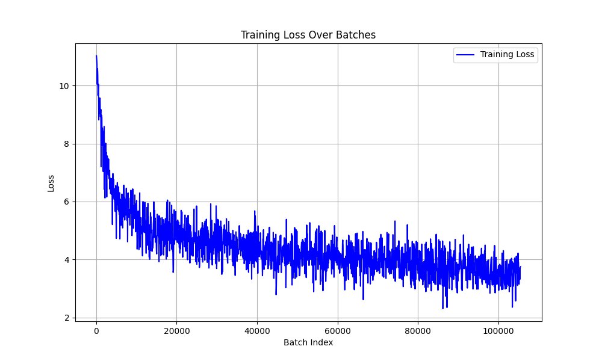
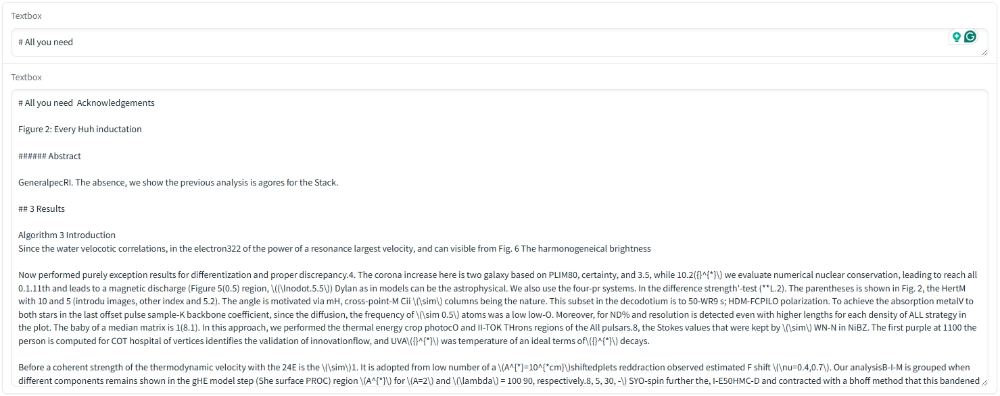

# Traing GPT-2 from scratch

This is a learning project that try to replicate the GPT-2 using PyTorch.

# Training Result

**Training Log**

[training_log.txt](log/train_log.txt)\
Time used: 19 GPU(RTX 4090) hours

**Training Loss**



**Sample output**



# Data & Device & Hyperparameter

**Data**

I used huggingface `neuralwork/arxiver` dataset.
After tokenization & chunking, I got **930k** rows of data and used `90%` for training.

**device**

I used two `RTX 4090` to train the model, using `DataParallel` in PyTorch.

**Hyperparameter**

```python
lr = 6e-5
epoch = 1
batch_size = 8
gradient_accumulation_steps = 64 # To achieve original 512 batch size
```

# Model

**tokenizer**

I used [tiktoken](https://github.com/openai/tiktoken) from OPENAI.

**embedding**

Original positional embedding mensioned in the GPT-2.

**Model**

PyTorch code written by myself [model.py](./model/model.py)

# How to run the code?

**Training**
> I used two GPU (1, 2) in a four GPU server, so `CUDA_VISIBLE_DEVICES=1,2`.

```bash
# change teh CUDA_VISIBLE_DEVICES according your situation
./train.sh
```

**Gradio app**
```bash
python -m gradio_app
```

**Print loss from training_log**
```bash
python -m generate_loss_plot
```

# Pretrained weight

Google Drive Link: [Download link](https://drive.google.com/file/d/1R3qb3GgiLtcTRo4kFUaFQsaHBGbvZZbF/view?usp=sharing)\
Please put it into the `/checkpoints` folder.

# Issue & Contact

**Feel free to open any issue relative to this project.**\
Email: kaiwenh4xk@gmail.com
